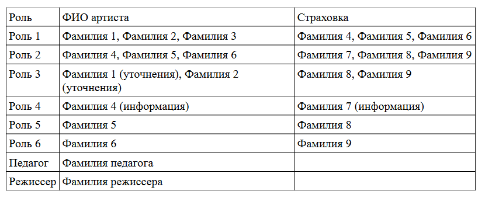
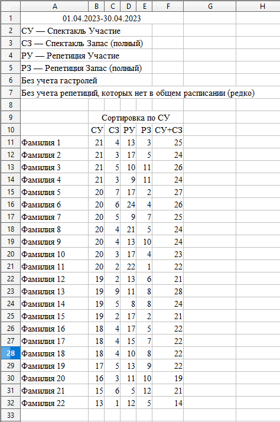

# Mariinsky counter
Для внутреннего пользования.\
Разработан как для артистов (для ознакомления с объемом выполняемой работы),
так и для руководства (для равного распределения и начисления премий).\
Скрипт парсит корпоративный сайт Мариинского театра с множеством html-страниц
с таблицами (таблица 1), вычленяет фамилии артистов, считает участие в 
репетициях и спектаклях для нужного временного периода и цеха с 
записью в файлы json, csv и сводную таблицу xls (таблица 2).\
Таблица 1. Пример исходной html-страницы.\
\
Таблица 2. Готовый отчет, собранный из около 200 таблиц за месяц. Для каждого
цеха своя таблица.\

